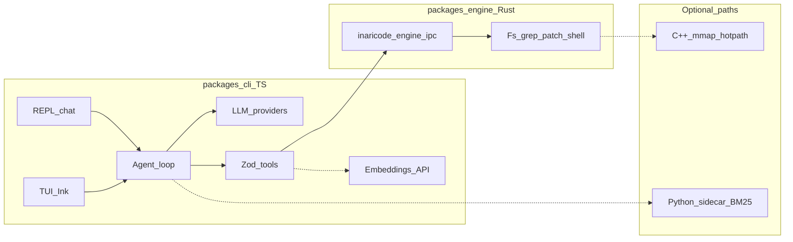

# InariCode — plan

## Where we are

The **core product loop is done**: chat (REPL + TUI), multi-provider LLM with streaming, agent loop with confirmations, Rust engine IPC + native binding, session files, semantic search (remote embeddings + cache), BM25 sidecar, redaction, `.inariignore`, **English / Mongolian** UI, **`inari pick`** (fuzzy / fzf), **shell completions**, and **chat UX** (slash commands, `--plain`, git branch in header). What remains is mostly **polish, accuracy, performance, and distribution** — not greenfield architecture.

| Area | Status | Where |
|------|--------|--------|
| CLI | `init`, `doctor`, `chat` (`--tui`) | [`packages/cli/src/cli.ts`](../../packages/cli/src/cli.ts) |
| i18n | `en` / `mn` (`locale`, `INARI_LANG`) | [`packages/cli/src/i18n/`](../../packages/cli/src/i18n/) |
| Engine | JSON-line IPC + napi `ipcRequest` | [`packages/engine`](../../packages/engine), [`packages/engine-native`](../../packages/engine-native) |
| LLM | Anthropic + OpenAI-compatible | [`packages/cli/src/config.ts`](../../packages/cli/src/config.ts), [`packages/cli/src/llm/`](../../packages/cli/src/llm/) |
| Agent | Turn loop, tool → engine / sidecar | [`packages/cli/src/agent/loop.ts`](../../packages/cli/src/agent/loop.ts) |
| Session | JSON **`--session`**, **`/compact [n]`** (trim by user turn) | [`file-session.ts`](../../packages/cli/src/session/file-session.ts), [`compact-history.ts`](../../packages/cli/src/session/compact-history.ts) |
| Sidecar | Python BM25 `codebase_search` (optional) | [`packages/sidecar/`](../../packages/sidecar/), [`packages/cli/src/sidecar/`](../../packages/cli/src/sidecar/) |
| Semantic | `/embeddings` + `.inaricode/semantic-cache-v1.json` | [`semantic-search.ts`](../../packages/cli/src/tools/semantic-search.ts), [`embeddings-api.ts`](../../packages/cli/src/tools/embeddings-api.ts) |
| Outline | `symbol_outline` — **tree-sitter** (TS/JS/TSX/JSX) + regex fallback / Py·Rs·Go | [`symbol-outline.ts`](../../packages/cli/src/tools/symbol-outline.ts), [`symbol-outline-ast.ts`](../../packages/cli/src/tools/symbol-outline-ast.ts) |
| Picker / UX | `inari pick`, `inari completion`, fuzzy [`fuzzy/match.ts`](../../packages/cli/src/fuzzy/match.ts) | [`packages/cli/src/pick/`](../../packages/cli/src/pick/), [`completion/render.ts`](../../packages/cli/src/completion/render.ts) |
| Config / keys | **`inaricode.yaml`** + `keys:` map | [`config.ts`](../../packages/cli/src/config.ts), [`config-paths.ts`](../../packages/cli/src/config-paths.ts) |
| Cursor cloud | **`inari cursor`** (Cloud Agents API) | [`cursor-api/`](../../packages/cli/src/cursor-api/), [`integrations/cursor.md`](../integrations/cursor.md) |
| Skills (declarative) | **`skills.packs`** + **`inari skills list`**; Zod + chat allowlist / prompt | [`packages/skills/`](../../packages/skills/README.md), [`packages/cli/src/skills/`](../../packages/cli/src/skills/), [`docs/skills.md`](../skills.md) |
| Publish hygiene | **`pack:check`**, **`verify:all`**, **`prepublishOnly`** | Root [`package.json`](../../package.json), [`packages/cli/package.json`](../../packages/cli/package.json) |

**Largest gaps vs “best in class”:** **distribution** (easy install for newbies), **plugins / skill marketplace / full theme packs**, **power-user ergonomics** (**vim**/**tmux**-friendly flows), **RAM footprint** (long TUI sessions + Node), **long-context** summarization + **TUI transcript** bounds, **tree-sitter** for more languages (Rust blocked on peer deps today), optional **C++** mmap (only if [profiling](../engine-profiling.md) justifies it).

---

## How to improve this roadmap (meta)

Use the plan as a **decision log**, not a wishlist.

1. **Lead with outcomes** — e.g. “New contributor can run `inari doctor` successfully in under five minutes” beats “add more docs” without a test.
2. **Order by dependencies** — CI and a single documented **build matrix** unlock everything else; tree-sitter depends on agreeing on **per-language** scope.
3. **Time horizons** — tag items **now (0–4 weeks)**, **next (1–3 months)**, **later (quarter+)** so the table stays honest.
4. **Non-goals** — say what you will *not* do this year (see below); it prevents roadmap noise.
5. **Measurable “done”** — each backlog row should have a **verifiable** completion (test, command, or doc section).

---

## Research-informed sequencing

[`docs/research/architecture-and-supply-chain.md`](../research/architecture-and-supply-chain.md) compares InariCode to common **agent-CLI** shapes (tools, doctor, skills, MCP, publish hygiene) **without** copying third-party code. Use it to **justify order**: ship **distribution + supply chain** before heavy **ecosystem** work.

| Research theme | Plan phase | Concrete step (repo today) |
|----------------|------------|----------------------------|
| **Supply chain** — tarball contents, `.map` trade-offs | **4** | **`yarn pack:check`** + CI; **`prepublishOnly: tsc`**; `files`: `dist` + `assets` only; optional future **`tsconfig.publish.json`** without maps |
| **Distribution / trust** | **4** | npm/binary path, platform matrix, contributor quickstart |
| **Session context** — long chats | **5** | **`/compact [n]`** shipped (**lossy** trim by user turn); still open: **summarization**, token/cost hints |
| **Declarative skills** | **6** | **`packages/skills/`** + **`skill.manifest.schema.json`** + example; **loader + `inari skills list`** still backlog |
| **MCP / IDE depth** | **7** | **`inari cursor`** today; full **MCP** = promote from *Ideas* after **P1** install story is stable |
| **Lazy load / RAM** | **5–6** | More **`import()`** audit; TUI transcript bounds; **`--low-memory`** |

---

## Goals

Ship a **local**, **engine-sandboxed** CLI comparable to other coding agents: multi-turn chat, edits with confirmations, shell under policy, codebase-aware tools — with disk/process work in **Rust**, not ad-hoc Node `fs` / `child_process`.

---

## Architecture



**One turn:** user message → LLM (tools) → TS validates → engine IPC (or sidecar/embeddings) → tool results → LLM until stop or step limit.

---

## Stack

| Layer | Choices |
|-------|---------|
| **TS** | Node 20+, strict TS, Commander, Zod, Vitest, cosmiconfig, Yarn workspaces, Ink + React (TUI) |
| **LLM** | `@anthropic-ai/sdk`; `openai` for Chat Completions + tools (OpenAI-compatible URLs) |
| **Rust** | clap, serde_json, ignore, regex, similar, diffy, tokio |

**Provider IDs** live in **`ProviderIdSchema`** in [`config.ts`](../../packages/cli/src/config.ts). **Engine:** JSON line in/out; same payload to **`ipcRequest`** in [`@inaricode/engine-native`](../../packages/engine-native). **`INARI_ENGINE_IPC=subprocess`** forces subprocess; default **`auto`** prefers native when `.node` loads.

**Grep / index:** `.gitignore` + **`.inariignore`**. **Sidecar:** JSON lines; `sidecar.enabled` + optional **`INARI_SIDECAR_CMD`**. **Semantic cache:** under **`.inaricode/`** (root `.gitignore`).

---

## Repo layout

```
inaricode/
  package.json
  packages/cli/src/     # cli, config, llm, agent, tools, media, pick, fuzzy, completion, ui, session, engine client, policy, i18n
  packages/engine/
  packages/engine-native/
  packages/sidecar/
  packages/tasks/       # task templates (future automation)
  packages/skills/      # declarative skill examples + schema
  docs/plan/            # this file
  docs/research/        # architecture + supply-chain notes (ordering aid)
```

---

## Product scope

| Theme | Implemented | Next (prioritized) |
|-------|-------------|---------------------|
| Chat / history | REPL, TUI, `--session`, `maxHistoryItems`, **`/compact [n]`** (lossy, user-turn trim) | **Summarization** + **token budgeting** for long threads (see *Research-informed sequencing*) |
| Edits | read/write/list/grep/search_replace/**apply_patch** | **Multi-file patch UX**, clearer conflict reporting |
| Shell | `run_cmd` + policy + confirm | Hardening from real-world abuse patterns |
| Context | `--root`; grep + semantic honor ignore files | **More grammars** for `symbol_outline` (Rust, etc.); **tree-sitter-rust** when peer-aligned |
| LLM | Multi-provider (incl. **Hugging Face router**, **Google Gemini** OpenAI-compat), streaming, `--no-stream` | Retry/backoff policy; token budgeting (doc + optional flags) |
| Multimodal | `inari media image` (HF Inference text-to-image); `media video` = guidance only | Google **Imagen** / **Veo**-class APIs; HF video models — wire per vendor when stable |
| i18n | EN + MN across CLI surfaces | More strings as features land; contributor note in README |
| Install | From source (`yarn build`); **`yarn pack:check`**; tag **`publish.yml`** + **[`publishing.md`](../publishing.md)** | Optional **release** tarball without source maps (`tsconfig.publish.json`); **prebuilt** engine binaries / published **`@inaricode/engine-native`** still future |
| Picker / shell | `pick`, `completion`, `INARI_PICKER` | **Narrower default globs** in docs; **watch mode** pick |
| **Skills / plugins / themes** | — (not shipped) | **Installable packs** (prompt + tools + slash); **plugins** (hooks) with sandbox; **themes** (ANSI + Ink); **newbie** preset + guided init |
| **Power-user shells** | REPL readline; Ink TUI | **Vim-like** TUI keymaps; **tmux** layouts + docs; optional **`--stdio`** for scripting |
| **Memory (RAM)** | History trim; lazy imports | **Caps** on transcript/tool buffers; **`--low-memory`**; document typical RSS |

---

## Extensibility roadmap (skills · plugins · themes)

Target: **newcomers** get sensible defaults; **power users** customize without forking.

| Track | Direction | Notes |
|-------|-----------|--------|
| **Installable AI skills** | Folders or packages: **system prompt** snippets, **tool allowlists**, **slash hints** in `/help`. | **v1:** [`skills.packs`](../skills.md), **`inari skills list`**, chat prompt + allowlist, **`inari doctor`**. Next: registry / version pins, marketplace. |
| **Plugins** | Later: allowlisted **JS hooks** or **WASM** at defined lifecycle points. | Default **off**; `plugins: { enabled, allowlist }`; security doc before any code execution. |
| **Themes** | `theme: 'dark' \| 'light' \| <path>` for REPL ANSI + Ink. | Ship **2–3** built-in; contrast notes for a11y. |
| **Newbie-friendly** | `inari init --template beginner`, **`inari onboard`**, richer **`/help`**, “first 5 minutes” in README. | Lowers setup anxiety (keys, engine, workspace). |

---

## Engineering optimizations (ongoing)

Low-risk improvements to keep doing as you touch code:

| Area | Idea |
|------|------|
| **CI** | **`yarn verify`** = Turbo **lint + build + test** (`@inaricode/cli`). **`yarn verify:all`** adds **`cargo test`** (`packages/engine`) + **`yarn pack:check`** (`npm pack --dry-run` for the CLI). CI: engine build + same Turbo pipeline + pack check. Cache: **`.turbo/`** (gitignored). |
| **Cold start** | Lazy `import()` for heavy paths (already used in places); avoid loading Ink until `chat --tui` / `pick`. |
| **Pick scale** | Cap candidate count (already ~25k); document **narrow `picker.defaultFileGlob`** for huge monorepos. |
| **Config** | Split optional **partial config** loaders (picker-only) vs full `loadConfig` to avoid API-key requirement for more commands. |
| **Rust** | `cargo clippy` in CI (optional job); keep **subprocess** IPC path tested (`INARI_ENGINE_IPC=subprocess`). |
| **RAM** | Profile **heap** on 30‑min TUI session; cap **in-memory history** + **streaming buffer**; clear **tool output** from UI buffer after round; optional **external pager** for huge tool results. |
| **Vim / tmux** | Document **`tmux new-session` + split** with `inari chat --tui` in one pane; optional **`$INARICODE_VIM_KEYS=1`** for TUI bindings (j/k, Ctrl‑U/D). |

---

## Ideas & experiments (not committed)

Exploratory — promote to **Prioritized backlog** only when you have capacity and a “done when”.

| Idea | Why it might matter |
|------|---------------------|
| **`/pick` in chat** | Insert `inari pick` result into the REPL transcript (paste path into next user message). |
| **MCP server** | Expose tools to **Cursor / Claude Desktop** via Model Context Protocol (thin wrapper over engine IPC). |
| **Plugin hooks** | User script after each tool round (audit log, custom policy) — high security review cost. |
| **Local embeddings** | Optional Ollama / small model for `semantic_codebase_search` without cloud API. |
| **Structured logging** | `INARI_LOG=json` for CI / debugging agent loops without scraping ANSI. |
| **TUI transcript scroll** | Ink viewport or pager for long sessions (today transcript grows unbounded in memory). |
| **Workspace profiles** | Multiple named configs (e.g. `inaricode.work.json`) for different roots/providers. |
| **Diff preview** | Before `apply_patch`, fish-style inline diff in confirm UI. |
| **Telemetry (opt-in)** | Anonymous crash/feature flags — only with explicit consent and privacy doc. |
| **Skill marketplace (later)** | Curated index (git URL or registry) — only after local skill format stabilizes. |
| **Headless daemon** | Long-running `inari serve` for multiple front-ends — large scope; overlaps MCP. |
| **Voice → chat input (mic)** | **Open-source goal:** user speaks; **full transcript** lands in the **CLI / TUI text field** (append or replace per setting). Needs **opt-in**, clear **privacy** story (local **Whisper**/Vosk vs OS **Web Speech** vs cloud API), push-to-talk or toggle, and **cross-platform** capture (PipeWire/Pulse, CoreAudio, WASAPI). |

---

## Security (baseline)

- Confirm **write_file**, **search_replace**, **run_terminal_cmd** unless `chat --yes`.
- Tool output **redaction** before the model (`packages/cli/src/tools/redact.ts`); extend patterns as you learn leaks.
- Engine enforces workspace path sandbox (no `..` in rel paths).

---

## Prioritized backlog

Rough order: each item unlocks or de-risks the next.

| Priority | Horizon | Item | Done when |
|----------|---------|------|-----------|
| **P0** | Now | **CI** — [`../../.github/workflows/ci.yml`](../../.github/workflows/ci.yml): Turbo **lint + build + test**, `cargo test`, **`yarn pack:check`** on push/PR to `main` | Green checks on `main`; keep **`verify:all`** green locally before releases |
| **P0** | Now | **Contributor quickstart** — exact Node/Yarn/Rust versions, `build:native` pitfalls | README + plan link; `inari doctor` succeeds on clean clone |
| **P1** | Next | **Release path** — `inari` on PATH via `npm link` or published package; engine env vars documented | Install section has two supported flows |
| **P1** | Done | **Zsh completion depth** — match fish richness (`inari chat` flags, `media image` opts) | [`completion/render.ts`](../../packages/cli/src/completion/render.ts) zsh + bash nested; tests in [`completion-render.test.ts`](../../packages/cli/test/completion-render.test.ts) |
| **P1** | Done | **Profiling budget** — when to consider C++ (large-repo grep latency) | [`docs/engine-profiling.md`](../engine-profiling.md) |
| **P2** | Partial | **tree-sitter** for `symbol_outline` (TS/JS/TSX/JSX; Rust when deps align) | [`symbol-outline-ast.ts`](../../packages/cli/src/tools/symbol-outline-ast.ts) + tests; Py/Go/Rs stay regex until more grammars |
| **P2** | Later | **Thread summarization** — optional auto-compact over N turns (beyond manual **`/compact`**) | Config flag + deterministic behavior; complements lossy trim |
| **P2** | Partial | **Skills v1** + **chat themes** + **beginner init** | Shipped: **`skills.packs`**, **`inari skills list`**, doctor lines, **`chatTheme`**, **`init --template beginner`**, [`docs/skills.md`](../skills.md). Open: **full Ink theme packs**, skill **registry** |
| **P2** | Later | **RAM / memory mode** — caps + measurement doc | README “typical usage” + `--low-memory` or config |
| **P3** | Optional | **Mmap fast path** via Rust + [`cxx`](https://github.com/dtolnay/cxx) (optional C++ core) | **Only** if all steps in [P3 decision gate](#p3-decision-gate-mmap-and-optional-cxx) pass |
| **P3** | Optional | **Plugins v0** — allowlisted local hooks | Threat model written; default off |
| **P3** | Optional | **Voice input (STT)** — mic → REPL/TUI line editor | **Opt-in**; doc lists data paths (local vs cloud); works on Linux + macOS + Windows baseline |

### P3 decision gate: mmap and optional cxx

This item exists so the roadmap remembers a **possible** speed path without committing to a second language stack.

**What it would target:** scan- and IO-heavy work inside **`inaricode-engine`** (primarily **grep / read paths** on very large trees or multi‑GB files), not the TypeScript driver or LLM I/O.

**Order of operations (do not skip):**

1. **P1 — Profiling budget** — Add a short doc (e.g. `docs/engine-profiling.md`) plus an optional reproducible benchmark (fixed corpus + query + `cargo run --release` or script). Capture **wall time** and, if possible, **where** time goes (`perf`, `cargo flamegraph`, etc.).
2. **Rust-first optimizations** — Before any C++, try cheaper changes in `packages/engine` (examples: **`memmap2`** for large-file reads, buffer sizing, avoiding extra copies, parallelism only where correctness and ignore semantics stay clear). Ripgrep-class performance is **not** required; only remove obvious bottlenecks.
3. **Gate — open a C++ path only if all are true:**
   - Profiling shows a **stable** hot slice (e.g. a large fraction of wall time in byte scanning / mmap’d IO) **after** the Rust steps above.
   - The gap matters for **real** usage (document the scenario — e.g. “monorepo grep over X M LOC”).
   - You accept **ongoing cost**: C++ toolchain in CI, `cxx` FFI boundary, security review for unsafe boundaries, and debugging complexity.

**Default outcome:** Close the profiling ticket with “Rust is enough” or “memmap2 / algorithm fix sufficient” and **leave P3 cancelled** until new evidence appears.

---

## Non-goals (near term)

- Replacing the Rust engine with Node for file/shell operations.
- Bundling local **sentence-transformers** (heavy deps); remote `/embeddings` remains the supported default unless you explicitly scope a “local embeddings” project.
- Full IDE / LSP integration (separate product surface).
- Supporting every LLM vendor without maintainer capacity — **document** how to use `custom` + `baseURL` instead.
- **C++ / `cxx`** without completing **P1 profiling** and **Rust-first** attempts — see [P3 decision gate](#p3-decision-gate-mmap-and-optional-cxx).

---

## Risks & dependencies

| Risk | Mitigation |
|------|------------|
| **engine-native** build friction on Windows / ARM | Document matrix; CI builds; optional subprocess-only path (`INARI_ENGINE_IPC=subprocess`) |
| **API cost / leakage** | Redaction + docs on env keys; never log full tool payloads in prod |
| **Scope creep** | Use **non-goals** and **P0/P1** table; defer tree-sitter until CI + install story is stable |
| **Second language (C++)** | Only after P3 gate; otherwise permanent complexity for marginal gain |

---

## Phased delivery (historical)

<details>
<summary>Earlier phase notes (0–3+) — expanded detail</summary>

### Phase 0 — Scaffold (done)

Yarn workspaces, `inaricode-engine` JSON IPC, `init` / `doctor`, Vitest smoke.

### Phase 1 — MVP (done)

`inari chat` REPL, Anthropic + OpenAI-compatible presets, agent loop, engine tools, confirms, shell policy.

### Phase 2 — Parity (done)

Streaming, `--session`, `maxHistoryItems`, `apply_patch`, shell config + `readOnly`, `--no-stream`, napi-rs, Ink TUI.

### Phase 3 — Intelligence (done)

`.inariignore` for grep, redaction, Python BM25 sidecar, `inari doctor` sidecar ping.

### Phase 3+ — Deep features (done / ongoing)

Semantic search + cache, `symbol_outline` heuristics; backlog: tree-sitter, summarization, C++.

### Cross-cutting (shipped; not repeated above)

These landed alongside Phase 2–3+ work and are **done** (see frontmatter todos): **English / Mongolian i18n**, **`inari pick`** (fuzzy + optional **fzf**) + **shell completions**, **`inari media`** (image / video guidance). Later additions: **YAML `keys:`** config, **`inari cursor`**, **`/compact [n]`** session trim, **`packages/skills`** schema + example, **`yarn pack:check`** + **`prepublishOnly`**. They extend the product surface after the core agent loop.

</details>

---

## Roadmap snapshot

| Phase | State |
|-------|--------|
| 0 Scaffold | Done |
| 1 MVP agent | Done |
| 2 Parity (+ napi + TUI) | Done |
| 3 Intelligence (+ sidecar + redact) | Done |
| 3+ Semantic + outline | Shipped; **accuracy** = backlog |
| **4 Distribution & quality** | **Shipped (v1 bar)** — contributor quickstart, **`engine-platform.md`**, **`pack:check`** + **clippy** + **napi Linux** CI, tag **`publish.yml`** + manual npm path |
| **5 Accuracy & long sessions** | **In progress** — **tree-sitter** outlines (**TS/JS** shipped); **doctor** session hints; **zsh/bash** depth; **profiling** doc; still open: **summarization**, **TUI scroll**, deeper **patch** UX |
| **6 Ecosystem & onboarding** | **In progress** — **skills v1** + **`chatTheme`** + **beginner** init shipped; **vim**/**tmux**, **RAM** / low-memory, **full themes** still open |
| **7 Integrations & input** | **Ideas / later** — **MCP**, **`/pick` in chat**, **`INARI_LOG=json`**, **workspace profiles**, **voice (mic → STT → input)** |
| **8 Extensibility & research** | **Optional** — **plugins** v0, **skill marketplace**, **headless daemon**, **local embeddings**, opt-in **telemetry**; **C++ mmap** only via [P3 gate](#p3-decision-gate-mmap-and-optional-cxx) |

---

## Phased roadmap — improvements & new ideas (4+)

Each phase bundles **improvements** (polish, perf, docs) and **new ideas** from the [Ideas & experiments](#ideas--experiments-not-committed) table. Order reflects **dependencies** (e.g. skills format before marketplace; profiling before mmap).

### Phase 4 — Distribution & quality *(shipped — maintain as regressions appear)*

**Goal:** A stranger can install, verify, and trust the project.

| Track | Improvements & deliverables |
|-------|----------------------------|
| **Release** | npm / binary publish path; prebuilt **engine-native** matrix; documented **platform matrix** |
| **Contributor** | README + plan quickstart; **`inari doctor`** green on clean clone; exact Node / Yarn / Rust versions |
| **Supply chain** | **`pack:check`** in **`verify:all`** + CI; **`prepublishOnly: tsc`** on CLI; document **`.js.map`** trade-off ([research](../research/architecture-and-supply-chain.md)) |
| **Engineering** | **Partial config** loaders (keyless commands where safe); **pick** glob guidance for huge repos; optional **`cargo clippy`** in CI |
| **Process** | **P0/P1** backlog rows owned or dated; v1 launch notes: [`../v1-launch-and-social.md`](../v1-launch-and-social.md) |

### Phase 5 — Accuracy & long sessions *(in progress)*

**Goal:** Smarter code context and sustainable long chats.

| Track | Improvements & deliverables |
|-------|----------------------------|
| **AST / outline** | **tree-sitter** `symbol_outline` for **TS / JS / TSX / JSX** (see `symbol-outline-ast.ts`); **regex** for Py / Go / Rs and TS/JS fallback; more grammars later |
| **Sessions** | **Manual:** **`/compact [n]`** (shipped). **Auto:** summarization / compaction after N turns; config-driven — still backlog |
| **Edits** | Clearer **multi-file patch** flow and conflict reporting; **diff preview** in confirm UI (from Ideas) |
| **Shell UX** | **Zsh** completions on par with fish for flags / subcommands |
| **TUI** | **Transcript scroll** or external pager — bound memory vs unbounded Ink transcript (Ideas + [RAM](#engineering-optimizations-ongoing) row) |
| **Perf (non-C++)** | **Profiling budget** doc + optional benchmark; Rust-first grep/IO tweaks before any C++ |

### Phase 6 — Ecosystem & onboarding *(in progress)*

**Goal:** Newbies feel welcome; power users can customize without forking.

| Track | Improvements & deliverables |
|-------|----------------------------|
| **Skills** | **v1 shipped:** **`skills.packs`**, Zod manifests, **`inari skills list`**, chat **prompt + tool union allowlist**, **`slash_hints`** in **`/help`**, **`inari doctor`** — no code in packs |
| **Look & feel** | **`chatTheme`:** `default` \| `soft` \| `high_contrast` (REPL ANSI + TUI accents). **Full** user theme files + wider Ink styling — backlog |
| **Onboarding** | **`inari init --template beginner`** (read-only, soft theme); **[`docs/skills.md`](../skills.md)**; richer **`/help`** / “first 5 minutes” — optional follow-up |
| **Power UX** | **Vim-like** TUI keymaps (e.g. `$INARICODE_VIM_KEYS`); **tmux** layout cookbook |
| **Footprint** | **RAM** caps, **low-memory** mode, measured RSS — see ongoing [engineering](#engineering-optimizations-ongoing) table |

### Phase 7 — Integrations & input

**Goal:** Fit into external tools and alternative input paths.

| Track | Ideas → deliverables |
|-------|---------------------|
| **Interop** | **MCP server** — **`inari mcp`** stdio JSON-RPC over engine tools (`read_file`, `list_dir`, `grep`); see [`docs/integrations/mcp.md`](../integrations/mcp.md) |
| **Observability** | **`INARI_LOG=json`** — JSON lines on stderr from the agent loop (`agent_turn_*`, `tool_result`, …) |
| **Chat workflow** | **`/pick` in chat** — opens the same picker as `inari pick`; sends the chosen **relative path** as the next user message |
| **Config** | **Workspace profiles** — **`INARI_PROFILE` / `INARICODE_PROFILE`**; **`inaricode.<profile>.yaml` / `.yml`** tried before generic `inaricode.yaml` (cosmiconfig search) |
| **Voice** | **Mic → STT → input** — full transcript into REPL/TUI field; opt-in; local vs cloud STT documented *(not shipped)* |

### Phase 8 — Extensibility & research *(optional / high cost)*

**Goal:** Deeper extension only after formats and threat models exist.

| Track | Ideas → deliverables |
|-------|---------------------|
| **Plugins** | **Placeholder:** `plugins.enabled` in schema **default false**; **`true` rejected** with pointer to [`docs/plugins-threat-model.md`](../plugins-threat-model.md). Execution / hooks **not** implemented |
| **Distribution of skills** | **Skill marketplace** (git/registry) — **after** skills v1 stabilizes |
| **Architecture** | **Headless daemon** (`inari serve`) — multiple front-ends; overlaps MCP; large scope |
| **Local ML** | **Local embeddings** (e.g. Ollama) for semantic search — optional parallel to remote `/embeddings` |
| **Trust** | **Telemetry (opt-in)** — crashes / flags; consent + privacy doc |
| **Perf research** | **C++ / mmap** — **only** if [P3 decision gate](#p3-decision-gate-mmap-and-optional-cxx) passes |

### Ideas → phase (quick index)

| Idea (from [Ideas & experiments](#ideas--experiments-not-committed) table) | Phase |
|---------------------------------------------------------------|--------|
| `/pick` in chat | 7 |
| MCP server | 7 |
| Structured logging (`INARI_LOG=json`) | 7 |
| Workspace profiles | 7 |
| Voice → chat input | 7 |
| Plugin hooks (security-heavy) | 8 |
| Local embeddings | 8 |
| TUI transcript scroll | 5 |
| Diff preview | 5 |
| Telemetry (opt-in) | 8 |
| Skill marketplace | 8 |
| Headless daemon | 8 |
| mmap / cxx fast path | 8 (gated) |

---

## Success criteria

**Already met (MVP bar):** small coding task with engine-backed tools, confirmations for risky ops, bounded outputs, Zod validation, engine errors visible to the model.

**Next bar (“v1 credible”):**

- A new machine can follow **README + plan** and get a green **`inari doctor`** without maintainer hand-holding.
- **CI** protects `main` from regressions in CLI tests and Rust tests.
- Roadmap **P0/P1** rows have owners or dates (even rough) so progress is visible.

---

## Maintenance

When you ship a major feature, update in one pass:

1. This file — **Where we are** table + **Prioritized backlog** + **Roadmap snapshot** / **Phased roadmap (4+)** (mark phase progress or move items).
2. Root [`README.md`](../../README.md) — features / commands if user-facing.
3. [`docs/plan/README.md`](./README.md) — only if the entrypoint to the plan changes.
