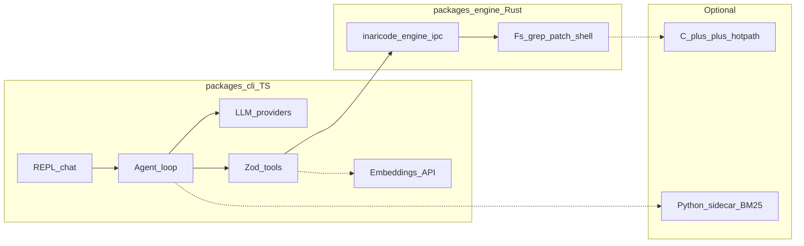

# InariCode — plan

## At a glance

| Area | Status | Where |
|------|--------|--------|
| CLI | `inari init`, `doctor`, `chat` (`--tui`) | [`packages/cli/src/cli.ts`](../../packages/cli/src/cli.ts) |
| Engine | JSON-line IPC + **napi** `ipcRequest` (same dispatch) | [`packages/engine`](../../packages/engine), [`packages/engine-native`](../../packages/engine-native) |
| LLM | Anthropic + OpenAI-compatible presets | [`packages/cli/src/config.ts`](../../packages/cli/src/config.ts), [`packages/cli/src/llm/`](../../packages/cli/src/llm/) |
| Agent | Turn loop, tool → engine / sidecar | [`packages/cli/src/agent/loop.ts`](../../packages/cli/src/agent/loop.ts) |
| Session | JSON load/save for `chat --session` | [`packages/cli/src/session/file-session.ts`](../../packages/cli/src/session/file-session.ts) |
| Sidecar | Python BM25 `codebase_search` (optional) | [`packages/sidecar/inari_sidecar.py`](../../packages/sidecar/inari_sidecar.py), [`packages/cli/src/sidecar/`](../../packages/cli/src/sidecar/) |
| Semantic search | `semantic_codebase_search` via **`/embeddings`** + `.inaricode/semantic-cache-v1.json` | [`packages/cli/src/tools/semantic-search.ts`](../../packages/cli/src/tools/semantic-search.ts), [`embeddings-api.ts`](../../packages/cli/src/tools/embeddings-api.ts) |
| Outline | `symbol_outline` (regex, not tree-sitter) | [`packages/cli/src/tools/symbol-outline.ts`](../../packages/cli/src/tools/symbol-outline.ts) |

**Gap vs ideal:** **C++** mmap hot path and **full tree-sitter** parsing still optional; local **Python sentence-transformers** embeddings not bundled (remote `/embeddings` is the supported path).

## Goals

Local CLI comparable to Claude Code / Qwen Code: **multi-turn chat**, **edits** with confirmations, **shell** with policy, **codebase-aware** tools — with disk/process work in **Rust**, not ad-hoc Node `fs`/`child_process`.

## Architecture



**One turn:** user message → LLM (tools) → TS validates → **engine IPC** → tool results → LLM until stop or step limit.

## Stack

| Layer | Choices |
|-------|---------|
| **TS** | Node 20+, strict TS, Commander, readline, Zod, Vitest, cosmiconfig, Yarn workspaces |
| **LLM** | `@anthropic-ai/sdk`; `openai` package for Chat Completions + tools (OpenAI-compatible URLs) |
| **Rust** | clap, serde_json, ignore, regex, similar, diffy, tokio |

**Provider IDs** (presets + env keys) live in **`ProviderIdSchema`** in [`config.ts`](../../packages/cli/src/config.ts) — includes e.g. `openai`, `kimi`, `qwen`, `ollama`, `egune`/`eguna`, `mongol_ai`, `custom`, etc. Override **`baseURL`** / **`model`** when vendor docs differ.

**Engine contract:** one JSON object per stdin line; reply one JSON line — same payload is passed to **`ipcRequest`** in [`@inaricode/engine-native`](../../packages/engine-native). Use **`INARI_ENGINE_IPC=subprocess`** to force the `inaricode-engine` subprocess; default **`auto`** prefers native when the `.node` binding loads.

**Grep** walks with **`.gitignore` + `.inariignore`** (gitignore-style rules via the `ignore` crate). **Sidecar:** one JSON line in/out per process; enable with **`sidecar: { enabled: true }`** in config, **`pip install -r packages/sidecar/requirements.txt`** (pathspec for `.inariignore`), optional **`INARI_SIDECAR_CMD`** / **`sidecar.command`**. **Semantic index:** **`globby`** + gitignore + `.inariignore` lines; cache under **`.inaricode/`** (gitignored in this repo’s root `.gitignore`).

## Repo layout

```
inaricode/
  package.json              # workspaces, scripts (incl. build:native)
  packages/cli/src/         # cli, config, llm/*, agent/*, tools/* (semantic-search, embeddings-api, symbol-outline), ui/*, session/*, engine/client.ts, policy/*
  packages/engine/src/      # lib.rs (dispatch) + main.rs (ipc bin) + fs_ops, grep_ops, paths, process_ops
  packages/engine-native/   # napi-rs crate + generated index.js / *.node (gitignore .node)
  packages/sidecar/       # inari_sidecar.py (BM25 codebase_search) + requirements.txt
  docs/plan/                # this file
```

## Product scope

| Theme | Implemented | Planned |
|-------|-------------|---------|
| Chat / history | REPL; `--session` JSON; `maxHistoryItems` trim | Long-thread summarization |
| Edits | read/write/list/grep/search_replace/**apply_patch** (diffy) via engine | Stronger patch UX; multi-file patches |
| Shell | `run_cmd` + caps + confirm; config **shell.denySubstrings** / **allowCommandPrefixes**; `readOnly` / `--read-only` | n/a |
| Context | `--root`; grep + semantic index honor **.gitignore + .inariignore** | Local Python ST embeddings; C++ scan |
| LLM | Multi-provider; **streaming** (Anthropic + OpenAI stream); `--no-stream` | n/a |

## Security (baseline)

- Confirm **write_file**, **search_replace**, **run_terminal_cmd** (unless `chat --yes`).
- Tool outputs pass through **light redaction** (common API key shapes and `key=value` secrets); expand as needed.
- Engine enforces paths under workspace (no `..` segments in rel paths).

## Phased delivery

### Phase 0 — Scaffold (**done**)

- Yarn workspaces: `packages/cli`, `packages/engine`
- `inaricode-engine` + `ipc` JSON-line protocol (incl. `echo` / smoke path)
- `inari` CLI: `init`, `doctor`, Vitest for engine wiring

### Phase 1 — MVP agent (**done**)

- **`inari chat`** readline REPL; in-memory conversation history for the session
- **LLM:** Anthropic Messages + **OpenAI-compatible** Chat Completions (presets in `config.ts`: OpenAI, Kimi, Qwen, Ollama, Groq, Together, Egune/Eguna, Mongol AI, `custom`, …)
- **Agent loop:** tool rounds with `maxAgentSteps`; system prompt with workspace root
- **Tools → engine:** `read_file`, `write_file`, `list_dir`, `grep`, `search_replace`, `run_terminal_cmd` via `engineRequest` / Zod
- **Safety:** prompts for write/search_replace/shell unless `chat --yes`; small shell substring denylist
- **Not in Phase 1:** token streaming, session persistence file, `apply_patch`, napi-rs, Ink TUI

### Phase 2 — Quality & parity (**done**)

- **Done:** token **streaming** (Anthropic + OpenAI-compatible); **`--session`** JSON persistence; **`maxHistoryItems`**; **`apply_patch`** (Rust `diffy` + TS tool); **config `shell`** + **`readOnly`** / **`chat --read-only`**; **`--no-stream`**
- **Phase 2b done:** **`@inaricode/engine-native`** (napi-rs **`ipcRequest`**); **`inari chat --tui`** (Ink + React)

### Phase 3 — Intelligence baseline (**done**)

- **`.inariignore`** honored by **`grep`** (same semantics as `.gitignore` patterns via `ignore` crate).
- **Tool output redaction** before results go to the model (`packages/cli/src/tools/redact.ts`).
- **Python sidecar** [`packages/sidecar/inari_sidecar.py`](../../packages/sidecar/inari_sidecar.py): JSON line RPC, **`codebase_search`** (BM25, UTF-8 text files, size caps), optional **`pathspec`** for `.inariignore`; **`inari doctor`** pings when `sidecar.enabled`.
- Config: **`sidecar: { enabled, command? }`**, env **`INARI_SIDECAR_CMD`**, **`INARI_PYTHON`**.

### Phase 3+ — Deep features (**partially done**)

- **Done:** **`semantic_codebase_search`** — OpenAI-compatible **`POST …/embeddings`**, cosine similarity, on-disk cache (`.inaricode/semantic-cache-v1.json`), **`embeddings: { enabled, model?, baseURL?, apiKey? }`** (Anthropic chat defaults to OpenAI embeddings URL + **`OPENAI_API_KEY`** unless overridden). **`symbol_outline`** heuristic for TS/JS, Python, Rust, Go.
- **Still optional / backlog:** C++ mmap hot path behind Rust (**`cxx`**); **tree-sitter**-accurate AST outlines; **plugin hooks**; optional **sentence-transformers** inside the Python sidecar.

## Roadmap (short)

| Phase | State |
|-------|--------|
| 0 Scaffold | Done |
| 1 MVP agent | Done |
| 2 Parity | Done (incl. 2b napi + Ink) |
| 3 Intelligence | Done (inariignore + redact + Python BM25 search) |
| 3+ Deep features | In progress (remote embeddings + outline shipped; cxx / tree-sitter / plugins backlog) |

## Success criteria

- User can complete a small coding task with **engine-backed** tools, **visible confirmations** for risky ops, and **bounded** file/command output.
- Tool args validated in TS; engine errors returned as tool text for the model to correct.
