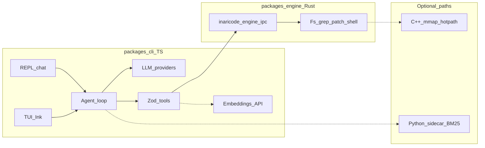

# InariCode — plan

## Where we are

The **core product loop is done**: chat (REPL + TUI), multi-provider LLM with streaming, agent loop with confirmations, Rust engine IPC + native binding, session files, semantic search (remote embeddings + cache), BM25 sidecar, redaction, `.inariignore`, and **English / Mongolian** UI. What remains is mostly **polish, accuracy, performance, and distribution** — not greenfield architecture.

| Area | Status | Where |
|------|--------|--------|
| CLI | `init`, `doctor`, `chat` (`--tui`) | [`packages/cli/src/cli.ts`](../../packages/cli/src/cli.ts) |
| i18n | `en` / `mn` (`locale`, `INARI_LANG`) | [`packages/cli/src/i18n/`](../../packages/cli/src/i18n/) |
| Engine | JSON-line IPC + napi `ipcRequest` | [`packages/engine`](../../packages/engine), [`packages/engine-native`](../../packages/engine-native) |
| LLM | Anthropic + OpenAI-compatible | [`packages/cli/src/config.ts`](../../packages/cli/src/config.ts), [`packages/cli/src/llm/`](../../packages/cli/src/llm/) |
| Agent | Turn loop, tool → engine / sidecar | [`packages/cli/src/agent/loop.ts`](../../packages/cli/src/agent/loop.ts) |
| Session | JSON load/save (`--session`) | [`packages/cli/src/session/file-session.ts`](../../packages/cli/src/session/file-session.ts) |
| Sidecar | Python BM25 `codebase_search` (optional) | [`packages/sidecar/`](../../packages/sidecar/), [`packages/cli/src/sidecar/`](../../packages/cli/src/sidecar/) |
| Semantic | `/embeddings` + `.inaricode/semantic-cache-v1.json` | [`semantic-search.ts`](../../packages/cli/src/tools/semantic-search.ts), [`embeddings-api.ts`](../../packages/cli/src/tools/embeddings-api.ts) |
| Outline | `symbol_outline` (regex heuristics) | [`symbol-outline.ts`](../../packages/cli/src/tools/symbol-outline.ts) |

**Largest gaps vs “best in class”:** **distribution** (easy install for others), **CI**, **tree-sitter-level** structure (vs regex outline), **long-context** behavior (summarization / compaction), optional **C++** mmap (only if profiling proves Rust path is too slow).

---

## How to improve this roadmap (meta)

Use the plan as a **decision log**, not a wishlist.

1. **Lead with outcomes** — e.g. “New contributor can run `inari doctor` successfully in under five minutes” beats “add more docs” without a test.
2. **Order by dependencies** — CI and a single documented **build matrix** unlock everything else; tree-sitter depends on agreeing on **per-language** scope.
3. **Time horizons** — tag items **now (0–4 weeks)**, **next (1–3 months)**, **later (quarter+)** so the table stays honest.
4. **Non-goals** — say what you will *not* do this year (see below); it prevents roadmap noise.
5. **Measurable “done”** — each backlog row should have a **verifiable** completion (test, command, or doc section).

---

## Goals

Ship a **local**, **engine-sandboxed** CLI comparable to other coding agents: multi-turn chat, edits with confirmations, shell under policy, codebase-aware tools — with disk/process work in **Rust**, not ad-hoc Node `fs` / `child_process`.

---

## Architecture



**One turn:** user message → LLM (tools) → TS validates → engine IPC (or sidecar/embeddings) → tool results → LLM until stop or step limit.

---

## Stack

| Layer | Choices |
|-------|---------|
| **TS** | Node 20+, strict TS, Commander, Zod, Vitest, cosmiconfig, Yarn workspaces, Ink + React (TUI) |
| **LLM** | `@anthropic-ai/sdk`; `openai` for Chat Completions + tools (OpenAI-compatible URLs) |
| **Rust** | clap, serde_json, ignore, regex, similar, diffy, tokio |

**Provider IDs** live in **`ProviderIdSchema`** in [`config.ts`](../../packages/cli/src/config.ts). **Engine:** JSON line in/out; same payload to **`ipcRequest`** in [`@inaricode/engine-native`](../../packages/engine-native). **`INARI_ENGINE_IPC=subprocess`** forces subprocess; default **`auto`** prefers native when `.node` loads.

**Grep / index:** `.gitignore` + **`.inariignore`**. **Sidecar:** JSON lines; `sidecar.enabled` + optional **`INARI_SIDECAR_CMD`**. **Semantic cache:** under **`.inaricode/`** (root `.gitignore`).

---

## Repo layout

```
inaricode/
  package.json
  packages/cli/src/     # cli, config, llm, agent, tools, ui, session, engine client, policy, i18n
  packages/engine/
  packages/engine-native/
  packages/sidecar/
  docs/plan/            # this file
```

---

## Product scope

| Theme | Implemented | Next (prioritized) |
|-------|-------------|---------------------|
| Chat / history | REPL, TUI, `--session`, `maxHistoryItems` | **Compaction / summarization** for long threads |
| Edits | read/write/list/grep/search_replace/**apply_patch** | **Multi-file patch UX**, clearer conflict reporting |
| Shell | `run_cmd` + policy + confirm | Hardening from real-world abuse patterns |
| Context | `--root`; grep + semantic honor ignore files | **tree-sitter** `symbol_outline` (scoped languages first) |
| LLM | Multi-provider, streaming, `--no-stream` | Retry/backoff policy; token budgeting (doc + optional flags) |
| i18n | EN + MN across CLI surfaces | More strings as features land; contributor note in README |
| Install | From source (`yarn build`) | **npm/binary story**, **CI**, documented **platform matrix** |

---

## Security (baseline)

- Confirm **write_file**, **search_replace**, **run_terminal_cmd** unless `chat --yes`.
- Tool output **redaction** before the model (`packages/cli/src/tools/redact.ts`); extend patterns as you learn leaks.
- Engine enforces workspace path sandbox (no `..` in rel paths).

---

## Prioritized backlog

Rough order: each item unlocks or de-risks the next.

| Priority | Horizon | Item | Done when |
|----------|---------|------|-----------|
| **P0** | Now | **CI** — [`../../.github/workflows/ci.yml`](../../.github/workflows/ci.yml): Vitest + `cargo test` on push/PR to `main` | Green checks on `main` (enable Actions in repo settings if needed) |
| **P0** | Now | **Contributor quickstart** — exact Node/Yarn/Rust versions, `build:native` pitfalls | README + plan link; `inari doctor` succeeds on clean clone |
| **P1** | Next | **Release path** — `inari` on PATH via `npm link` or published package; engine env vars documented | Install section has two supported flows |
| **P1** | Next | **Profiling budget** — when to consider C++ (large-repo grep latency) | One doc section + optional benchmark script |
| **P2** | Later | **tree-sitter** for `symbol_outline` (start with TS/JS or Rust only) | Tests on sample repos; fallback to regex |
| **P2** | Later | **Thread summarization** — optional auto-compact over N turns | Config flag + deterministic behavior |
| **P3** | Optional | **C++ mmap** via `cxx` | Only if P1 profiling justifies maintenance cost |

---

## Non-goals (near term)

- Replacing the Rust engine with Node for file/shell operations.
- Bundling local **sentence-transformers** (heavy deps); remote `/embeddings` remains the supported default unless you explicitly scope a “local embeddings” project.
- Full IDE / LSP integration (separate product surface).
- Supporting every LLM vendor without maintainer capacity — **document** how to use `custom` + `baseURL` instead.

---

## Risks & dependencies

| Risk | Mitigation |
|------|------------|
| **engine-native** build friction on Windows / ARM | Document matrix; CI builds; optional subprocess-only path (`INARI_ENGINE_IPC=subprocess`) |
| **API cost / leakage** | Redaction + docs on env keys; never log full tool payloads in prod |
| **Scope creep** | Use **non-goals** and **P0/P1** table; defer tree-sitter until CI + install story is stable |

---

## Phased delivery (historical)

<details>
<summary>Earlier phase notes (0–3+) — expanded detail</summary>

### Phase 0 — Scaffold (done)

Yarn workspaces, `inaricode-engine` JSON IPC, `init` / `doctor`, Vitest smoke.

### Phase 1 — MVP (done)

`inari chat` REPL, Anthropic + OpenAI-compatible presets, agent loop, engine tools, confirms, shell policy.

### Phase 2 — Parity (done)

Streaming, `--session`, `maxHistoryItems`, `apply_patch`, shell config + `readOnly`, `--no-stream`, napi-rs, Ink TUI.

### Phase 3 — Intelligence (done)

`.inariignore` for grep, redaction, Python BM25 sidecar, `inari doctor` sidecar ping.

### Phase 3+ — Deep features (done / ongoing)

Semantic search + cache, `symbol_outline` heuristics; backlog: tree-sitter, summarization, C++.

</details>

---

## Roadmap snapshot

| Phase | State |
|-------|--------|
| 0 Scaffold | Done |
| 1 MVP agent | Done |
| 2 Parity (+ napi + TUI) | Done |
| 3 Intelligence (+ sidecar + redact) | Done |
| 3+ Semantic + outline | Shipped; **accuracy** = backlog |
| **4 Distribution & quality** | **Active target** — CI, install story, profiling, then tree-sitter / summaries |
| Optional | C++ mmap if justified |

---

## Success criteria

**Already met (MVP bar):** small coding task with engine-backed tools, confirmations for risky ops, bounded outputs, Zod validation, engine errors visible to the model.

**Next bar (“v1 credible”):**

- A new machine can follow **README + plan** and get a green **`inari doctor`** without maintainer hand-holding.
- **CI** protects `main` from regressions in CLI tests and Rust tests.
- Roadmap **P0/P1** rows have owners or dates (even rough) so progress is visible.

---

## Maintenance

When you ship a major feature, update in one pass:

1. This file — **At a glance** table + **Prioritized backlog** (move row to done or delete).
2. Root [`README.md`](../../README.md) — features / commands if user-facing.
3. [`docs/plan/README.md`](./README.md) — only if the entrypoint to the plan changes.
