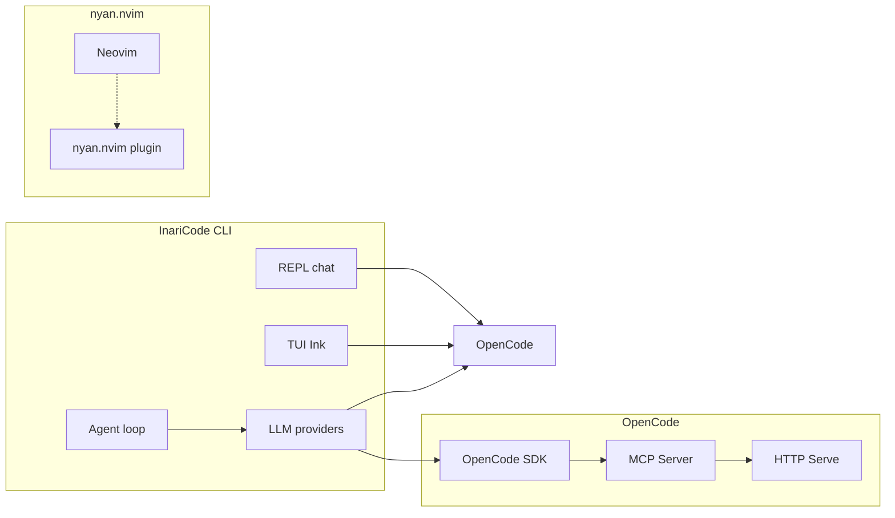

# InariCode + OpenCode + nyan.nvim Integration Plan

## Vision

**InariCode → OpenCode**: InariCode connects to OpenCode as a backend/provider, using OpenCode's SDK, MCP server, or HTTP serve API for AI capabilities.

**nyan.nvim**: Visual integration — InariCode integrates with Neovim's ecosystem awareness (not visual Nyan Cat itself, but awareness of when running inside Neovim).

---

## Architecture



---

## Phase 1: Foundation (Months 1-2)

### Goals
- Establish OpenCode integration architecture
- Set up Neovim detection and awareness
- Create core IPC mechanisms

### Deliverables

| Item | Description | Done when |
|------|-------------|-----------|
| **OpenCode client wrapper** | TypeScript wrapper around `@opencode-ai/sdk` | `packages/cli/src/opencode-client.ts` exists, basic `createOpencodeClient()` works |
| **Config schema update** | Add `opencode:` config section in `inaricode.yaml` | Schema supports `opencode.url`, `opencode.token`, `opencode.defaultModel` |
| **Provider integration** | Add OpenCode as LLM provider option | Can select `opencode` as provider in config |
| **Neovim detection** | Detect when running inside Neovim (nvim embedded) | `INARI_VIM=1` or `$NVIM` detection works |
| **OpenCode MCP client** | Connect to OpenCode MCP server | Can send prompts via MCP protocol |

### Tasks

```
| task                          | state      |
|-------------------------------|------------|
| create-opencode-client-wrapper | ready      |
| update-config-schema          | blocked(create-opencode-client-wrapper) |
| add-opencode-provider        | blocked(update-config-schema) |
| detect-neovim-environment    | ready      |
| implement-mcp-client        | blocked(create-opencode-client-wrapper) |
```

---

## Phase 2: Integration Core (Months 2-3)

### Goals
- Full OpenCode provider integration
- Neovim TUI awareness
- Session sharing capabilities

### Deliverables

| Item | Description | Done when |
|------|-------------|-----------|
| **OpenCode tool bridge** | Expose OpenCode tools to InariCode agent | Can use OpenCode's read/grep/write tools via InariCode |
| **Neovim TUI mode** | Special TUI rendering when inside Neovim | TUI detects `$NVIM` and adjusts layout |
| **Session sync** | Optional session sharing between InariCode and OpenCode | Can export/import sessions |
| **Provider fallback** | OpenCode as fallback when primary LLM fails | Seamless fallback to OpenCode on API error |
| **Completions via OpenCode** | Use OpenCode for shell completions | `inari completion` can use OpenCode fuzzy |

### Tasks

```
| task                    | state                    |
|-------------------------|--------------------------|
| opencode-tool-bridge    | blocked(phase1-mcp)      |
| neovim-tui-mode        | blocked(phase1-vim-det) |
| session-sync           | blocked(opencode-tool-bridge) |
| provider-fallback      | blocked(opencode-tool-bridge) |
| completions-via-opencode | blocked(opencode-tool-bridge) |
```

---

## Phase 3: nyan.nvim Awareness (Months 3-4)

### Goals
- Integrate neovim awareness in InariCode
- Visual status indicators
- Neovim plugin potential

### Deliverables

| Item | Description | Done when |
|------|-------------|-----------|
| **nyan.nvim awareness** | Detect nyan.nvim presence | Can report if nyan.nvim is active |
| **Status integration** | Show InariCode status in Neovim-aware output | Status bar shows agent state |
| **Vim keybindings** | Optional vim-style keybindings in TUI | j/k navigation works |
| **Neovim LSP hints** | Use Neovim LSP info for context | Symbol info from Neovim LSP |
| **Terminal detection** | Detect Kitty, WezTerm, Neovim UI | Terminal-specific rendering |

### Tasks

```
| task                    | state                    |
|-------------------------|--------------------------|
| nyan-detect             | ready                   |
| status-integration      | blocked(nyan-detect)     |
| vim-keybindings        | ready                   |
| neovim-lsp-hints      | blocked(nyan-detect)     |
| terminal-detection    | blocked(nyan-detect)    |
```

---

## Phase 4: Polish & UX (Months 4-5)

### Goals
- Refine user experience
- Error handling and recovery
- Documentation

### Deliverables

| Item | Description | Done when |
|------|-------------|-----------|
| **Error recovery** | Graceful degradation when OpenCode unavailable | Local fallback works |
| **Logging** | Structured logging for debugging | `INARI_LOG=json` shows integration events |
| **Docs** | Integration documentation | `docs/integrations/opencode.md` complete |
| **Tests** | Integration tests | Tests cover key flows |
| **Completion depth** | Zsh/fish completions for new commands | Full completion support |

---

## Phase 5: Stretch & Release (Month 6)

### Goals
- Release-ready integration
- Community polish
- Performance optimization

### Deliverables

| Item | Description | Done when |
|------|-------------|-----------|
| **Release notes** | Changelog for integration features | Blog-ready release notes |
| **Performance** | Latency optimization for OpenCode calls | <500ms for typical queries |
| **Security audit** | Token handling security review | No secrets in logs |
| **Version compatibility** | OpenCode version compatibility | Documented compatibility matrix |

---

## Task Dependencies

```
Phase 1 (M1-M2):
  create-opencode-client-wrapper → update-config-schema → add-opencode-provider
  create-opencode-client-wrapper → implement-mcp-client
  
Phase 2 (M2-M3):
  implement-mcp-client → opencode-tool-bridge → session-sync
  opencode-tool-bridge → provider-fallback
  phase1-vim-detect → neovim-tui-mode
  
Phase 3 (M3-M4):
  nyan-detect → status-integration → neovim-lsp-hints
  nyan-detect → terminal-detection
  
Phase 4 (M4-M5):
  All Phase 1-3 completions → error-recovery → docs → tests → completion-depth
  
Phase 5 (M6):
  All prior → release-notes → performance → security-audit → version-compat
```

---

## Configuration Schema

```yaml
# inaricode.yaml
opencode:
  enabled: true
  url: "http://localhost:4096"  # OpenCode serve URL
  token: "${OPENCODE_TOKEN}"   # From env if set
  defaultModel: "claude-sonnet"
  timeout: 30000
  fallback:
    enabled: true
    provider: "anthropic"      # Fallback when OpenCode fails
```

---

## Environment Variables

| Variable | Description | Default |
|----------|-------------|---------|
| `OPENCODE_URL` | OpenCode serve URL | `http://localhost:4096` |
| `OPENCODE_TOKEN` | OpenCode auth token | — |
| `INARI_OPENCODE_TIMEOUT` | Request timeout ms | `30000` |
| `INARI_VIM` | Force Vim mode | auto-detect |
| `NYAN_NVIM_PATH` | Path to check for nyan.nvim | `~/.local/share/nvim/site/pack/plugins/start/nyan.nvim` |

---

## Integration Points Summary

| Feature | Implementation | Priority |
|---------|---------------|----------|
| OpenCode SDK client | `@opencode-ai/sdk` wrapper | P0 |
| OpenCode MCP | MCP protocol client | P0 |
| Provider option | Add to `ProviderIdSchema` | P0 |
| Neovim detection | `$NVIM` / `$NVIM_APPNAME` | P1 |
| Tool bridge | Forward tools to OpenCode | P1 |
| Fallback | On OpenCode failure | P1 |
| nyan.nvim awareness | File detection | P2 |
| Terminal detection | `$TERM_PROGRAM` | P2 |
| Session sync | Import/export | P3 |
| Status integration | Output indicator | P3 |

---

## Non-Goals (Near Term)

- Creating an InariCode neovim plugin (separate project)
- Replacing InariCode's core with OpenCode
- Full bidirectional sync between both tools
- nyan.nvim visual rendering (that belongs in neovim configs)

---

## Risks & Mitigation

| Risk | Mitigation |
|------|-----------|
| OpenCode API changes | Version pinning, error handling |
| Neovim detection edge cases | Default to safe mode |
| Token security | Never log, env-only storage |
| Performance latency | Timeout + fallback |

---

## Success Criteria

After 6 months:
- [ ] InariCode can use OpenCode as LLM provider
- [ ] OpenCode MCP integration works
- [ ] Neovim detection + Vim keybindings in TUI
- [ ] nyan.nvim presence detected
- [ ] Graceful fallback when OpenCode unavailable
- [ ] Documentation complete
- [ ] Tests pass

---

## Monthly Milestones

| Month | Focus | Key Deliverable |
|-------|-------|-----------------|
| **M1** | SDK client | Basic `@opencode-ai/sdk` wrapper |
| **M2** | Config + MCP | Config schema + MCP client |
| **M3** | Tool bridge + fallback | OpenCode tools accessible |
| **M4** | nyan.nvim + vim | Detection + vim keybindings |
| **M5** | Polish | Error handling + docs |
| **M6** | Release | Version + compatibility |